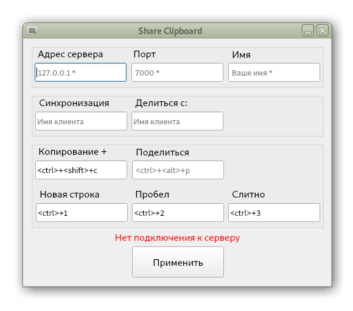

# Проект клиент-серверного приложения для работы с буфером обмена.
Версия 0.5
## Блок-схема проекта

## Функционал

Приложение позволяет синхронизировать буфер обмена разных операционных систем, и просто делиться содержимым буфера обмена с удаленными клиентами.

Функции приложения работают по событию изменения буфера обмена и посредством назначения и вызова горячих клавиш.

Имеется возможность соединения скопированного текста с предыдущем копированием с использованием одного из разделителей: "новая строка", "пробел" или "слитно"

### Особенности:

> Сохранение настроек.
>
> Вывод в поля ввода сохранённых значений при запуске.
>
> Вывод уведомлений в графический интерфейс окна приложения и всплывающим окном.
>
> Автоматическое переподключение.
>
> Лог окно для отладки, и лог файл.
> 
> Поддержка изображений.
>
> Создание файла изображения и просмотр.
>
> Работа на Linux и Windows

## Вид интерфейса

### Контекстное меню

## Окно логов

## Установка

На Linux для работы с буфером, необходимо установить:

> su root
>
> sudo apt-get install xclip
>
> sudo apt-get install xsel
>
> sudo apt-get --reinstall install libqt5dbus5 libqt5widgets5 libqt5network5 libqt5gui5 libqt5core5a libdouble-conversion1 libxcb-xinerama0

## Сервер

> ssh -p 13022 root@45.141.77.236
>
> root@45.141.77.236:13022  формат для mc
>
> docker build --tag zum/cp_server:0.0.1 -f .dockerfile .
>
> docker images 
>
> docker run -d --restart=always  --name cp_server -p 0.0.0.0:7000:7006 zum/cp_server:0.0.1
>
> 45.141.77.236:7000

